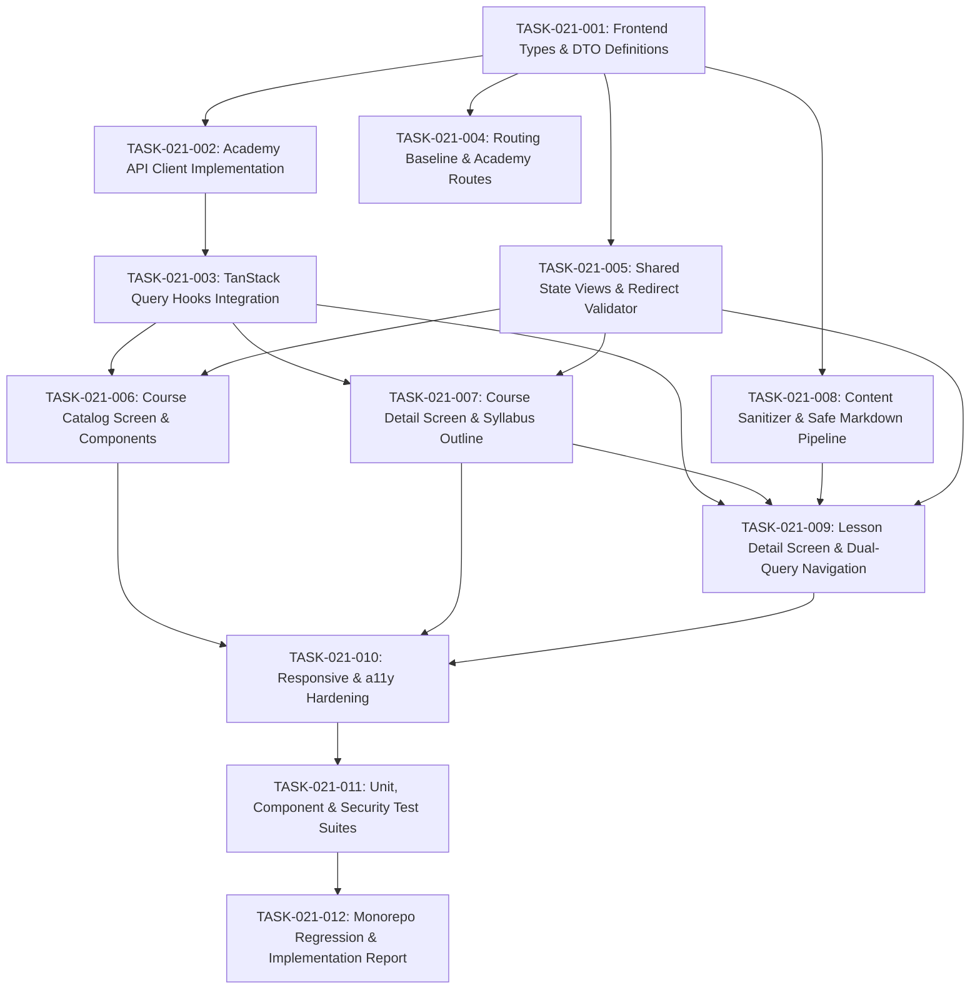

# Tasks: FEAT-021 Academy Learner Course/Lesson UI

**Status**: APPROVED FOR IMPLEMENTATION  
**Feature ID**: FEAT-021  
**Phase**: Phase 4 — Academy  
**Planning Owner**: Antigravity — Temporary Planning Ownership Transfer  
**Human Planning Approval**: APPROVED  
**Human UX Planning Decisions**: APPROVED  
**Implementation Agent**: Pending Human Approval  

---

## 1. Task Dependency Graph

---

## 2. Granular Task Breakdown

### Group A: Frontend API Client & Types

#### [ ] TASK-021-001: Frontend Types & DTO Definitions
- **File**: `apps/web/src/features/academy/types/academy-ui.types.ts`
- **Description**: Define TypeScript interfaces aligning exactly with FEAT-020 DTO contracts: `CourseSummaryDto`, `CourseDetailDto`, `LessonSummaryDto`, `LessonDetailDto`, and `PaginationMeta`. Define UI async state models per view (Catalog: `LOADING`, `SUCCESS`, `EMPTY`, `ERROR`; Detail: `LOADING`, `SUCCESS`, `NOT_FOUND`, `ERROR`; Lesson: `LOADING`, `SUCCESS`, `AUTH_REQUIRED`, `NOT_FOUND`, `ERROR`).
- **Dependencies**: None.
- **Verification**: `npm run typecheck` in `@aura/web`.

#### [ ] TASK-021-002: Academy API Client Implementation
- **File**: `apps/web/src/api/academy.api.ts`
- **Description**: Implement `AcademyApiClient` consuming approved FEAT-020 endpoints (`GET /api/academy/courses`, `GET /api/academy/courses/:slug`, `GET /api/academy/courses/:courseSlug/lessons/:lessonSlug`).
  - Implement error response normalization mapping backend error envelopes (`AppErrorResponse`) to normalized UI errors.
  - Obtain short-lived access token strictly through the existing approved frontend auth/session abstraction in `apps/web`.
  - Zero `localStorage`, `sessionStorage`, or JavaScript refresh-token storage.
  - Zero console logging of credentials.
- **Dependencies**: TASK-021-001.
- **Verification**: Unit tests mocking `fetch` responses and verifying headers.

#### [ ] TASK-021-003: TanStack Query Hooks Integration
- **File**: `apps/web/src/features/academy/hooks/use-academy.ts`
- **Description**: Implement `useCoursesQuery(params)`, `useCourseQuery(slug)`, and `useLessonQuery(courseSlug, lessonSlug)`.
  - Configure query keys: `["academy", "courses", params]`, `["academy", "course", slug]`, `["academy", "lesson", courseSlug, lessonSlug]`.
  - Set stale times (5 min for catalog/course, 2 min for lesson).
  - Handle independent error status codes (401 triggers `AUTH_REQUIRED`, 404 triggers `NOT_FOUND`).
- **Dependencies**: TASK-021-002.
- **Verification**: Unit tests with QueryClient wrapper.

---

### Group B: Routing Baseline

#### [ ] TASK-021-004: Routing Baseline & Navigation Integration
- **Files**: `apps/web/src/app/router/academy-routes.tsx`, `apps/web/src/app/App.tsx`
- **Description**: Configure declarative client routing for Academy feature paths:
  - `/academy` (and alias `/academy/courses`) $\rightarrow$ Course Catalog Page
  - `/academy/courses/:courseSlug` $\rightarrow$ Course Detail Page
  - `/academy/courses/:courseSlug/lessons/:lessonSlug` $\rightarrow$ Lesson Detail Page
  Integrate Academy entry link into the application navigation bar.
- **Dependencies**: TASK-021-001.
- **Verification**: Route navigation tests.

---

### Group C: Shared UI States & Redirect Security

#### [ ] TASK-021-005: Shared State Views & Redirect Validator
- **Files**:
  - `apps/web/src/features/academy/utils/redirect-validator.ts`
  - `apps/web/src/features/academy/components/AcademyStates.tsx`
- **Description**:
  - Implement `isValidInternalRedirect(path)` and `buildAuthRedirectUrl(authPath, returnPath)`: strictly validate that paths start with a single `/`, reject `//`, `/\`, and protocol schemes (`https:`, `javascript:`), and URI-encode redirect parameters.
  - Build accessible shared state components:
    - `LoadingSkeleton`: Card skeleton grid and reading shimmer placeholders with `aria-busy="true"`.
    - `EmptyState`: Empty illustration and message for zero search/filter matches with "Reset Filters" action.
    - `ErrorState`: Accessible error banner (`role="alert"`) with "Retry" action.
    - `AuthRequiredCard`: Informative card for 401 unauthenticated visitors with Sign In / Register actions preserving the validated internal return redirect.
- **Dependencies**: TASK-021-001.
- **Verification**: Unit tests for redirect validation and component render tests.

---

### Group D: Course Catalog Page

#### [ ] TASK-021-006: Course Catalog Screen & Components
- **Files**:
  - `apps/web/src/features/academy/components/CourseCard.tsx`
  - `apps/web/src/features/academy/components/LevelFilter.tsx`
  - `apps/web/src/features/academy/components/PaginationControls.tsx`
  - `apps/web/src/features/academy/pages/CourseCatalogPage.tsx`
- **Description**:
  - Build `CourseCard` implementing locked UX (Responsive Card Grid): title, description, level badge, published lesson count, and "View Outline" action link.
  - Build `LevelFilter` with `All`, `Beginner`, `Intermediate`, `Advanced` toggle pills (`aria-pressed`).
  - Build `PaginationControls` with previous, next, page numbers, and total item indicators.
  - Assemble `CourseCatalogPage` wiring TanStack Query, filter state, pagination state, loading skeletons, and empty state.
- **Dependencies**: TASK-021-003, TASK-021-005.
- **Verification**: Catalog page integration tests.

---

### Group E: Course Detail Page

#### [ ] TASK-021-007: Course Detail Screen & Syllabus Outline
- **Files**:
  - `apps/web/src/features/academy/components/LessonOutlineList.tsx`
  - `apps/web/src/features/academy/pages/CourseDetailPage.tsx`
- **Description**:
  - Build `LessonOutlineList` implementing locked UX (Numbered Vertical Outline): step numbers, titles, and read action links.
  - Derive `lessonCount = course.lessons.length` (never expecting `lessonCount` on `CourseDetailDto`).
  - Build `CourseDetailPage` displaying course hero (title, full description, level badge, derived lesson count), outline list, and generic 404 handler for nonexistent/draft/archived courses.
- **Dependencies**: TASK-021-003, TASK-021-005.
- **Verification**: Course detail integration tests.

---

### Group F: Lesson Content & Detail Page

#### [ ] TASK-021-008: Content Sanitizer & Safe Markdown Pipeline
- **Files**:
  - `apps/web/src/features/academy/utils/markdown-sanitizer.ts`
  - `apps/web/src/features/academy/components/LessonContent.tsx`
- **Description**:
  - Configure `DOMPurify` (using built-in types; no `@types/dompurify`) as the mandatory final sanitization boundary before DOM insertion. Strict allowed tags: `h1-h6`, `p`, `ul`, `ol`, `li`, `code`, `pre`, `blockquote`, `strong`, `em`, `table`, `a`, `hr`, `br`. Allowed attributes: `href`, `title`, `target`, `rel`. Hook enforces `rel="noopener noreferrer"` on external links. Neutralize `javascript:`, `data:`, `vbscript:`.
  - Configure `marked` with raw HTML parsing disabled by default as defense-in-depth.
  - Build isolated `LessonContent.tsx` rendering sanitized HTML inside a centered prose container (`max-width: approximately 720px`). Unsanitized `dangerouslySetInnerHTML` is strictly prohibited.
- **Dependencies**: TASK-021-001.
- **Verification**: Security unit tests verifying neutralization of XSS attack vectors.

#### [ ] TASK-021-009: Lesson Detail Screen & Dual-Query Navigation
- **File**: `apps/web/src/features/academy/pages/LessonDetailPage.tsx`
- **Description**: Assemble `LessonDetailPage` executing dual queries:
  - Query A: `useLessonQuery(courseSlug, lessonSlug)` for educational content.
  - Query B: `useCourseQuery(courseSlug)` for course metadata and published lesson outline.
  - Derive navigation: locate `lesson.slug === lessonSlug` inside `CourseDetailDto.lessons` and link adjacent elements (`currentIndex - 1`, `currentIndex + 1`). Never calculate `order - 1` / `order + 1`.
  - Graceful fallback: if Query A succeeds but Query B fails or is loading, render lesson content safely, fallback top breadcrumb to "Course", and omit previous/next navigation buttons without raising a fatal error.
  - State handling: 401 displays `AuthRequiredCard`; 404 displays generic "Lesson Unavailable".
- **Dependencies**: TASK-021-003, TASK-021-005, TASK-021-007, TASK-021-008.
- **Verification**: Lesson detail component, dual-query orchestration, and navigation fallback tests.

---

### Group G: Responsive & Accessibility Hardening

#### [ ] TASK-021-010: Responsive & a11y Hardening
- **Files**: `apps/web/src/index.css`, Academy components
- **Description**:
  - Implement responsive CSS breakpoints: 1 col (<640px), 2 col (640-1023px), 3 col ($\ge 1024px$).
  - Ensure zero horizontal scrolling on mobile viewports ($375px$, $414px$).
  - Add visible focus indicators (`outline: 2px solid var(--primary); outline-offset: 2px;`) to all interactive elements.
  - Ensure ARIA live regions for loading states (`aria-busy="true"`, `role="status"`) and error alerts (`role="alert"`).
  - Verify semantic heading hierarchy (single `<h1>` per view).
- **Dependencies**: TASK-021-006, TASK-021-007, TASK-021-009.
- **Verification**: Accessibility test suite and responsive viewport checks.

---

### Group H: Verification, Tests & Governance

#### [ ] TASK-021-011: Unit, Component & Security Test Suites
- **Files**: `apps/web/tests/**/*.test.tsx`, `apps/web/src/features/academy/**/*.test.tsx`
- **Description**: Implement comprehensive test suites:
  - Component tests: catalog rendering, level filtering, pagination, outline display, dual navigation.
  - Non-contiguous navigation test: verifies adjacent navigation links correctly when lesson order values have gaps (e.g. `10, 20, 30`).
  - Query B failure fallback test: verifies lesson content renders and adjacent buttons omit cleanly when course query fails.
  - Redirect safety tests: verifies `isValidInternalRedirect` rejects open redirects and protocols.
  - Security tests: verifies XSS attack-vector rejection against concrete payloads (`<script>`, inline event handlers `onload`/`onerror`/`onclick`, `javascript:` URLs, `data:` URLs, `iframe`, `form`, `style` injection, malformed nested HTML, and unsafe Markdown links).
  - Negative tests: 401 unauthenticated lesson view, 404 draft/archived/nonexistent course/lesson view, 500 network retry.
  - Accessibility baseline tests: heading levels, button accessible names, focus rings.
- **Dependencies**: TASK-021-010.
- **Verification**: `npm run test --workspace=@aura/web`.

#### [ ] TASK-021-012: Monorepo Regression & Implementation Report
- **Files**: `reports/implementation/phase-4/FEAT-021.md`
- **Description**: Execute full monorepo regression verification across all packages (`clean`, `lint`, `prisma validate`, `typecheck`, `build`, `test`, `test:unit`, `test:db`, `test:redis`, and all 5 guards). Compile comprehensive implementation report mapping all ACs.
- **Dependencies**: TASK-021-011.
- **Verification**: 100% green monorepo validation suite.

---

## 3. Task $\rightarrow$ AC Traceability Matrix

| Task ID | Task Description | Acceptance Criteria Covered |
| :--- | :--- | :--- |
| **TASK-021-001** | Frontend Types & DTO Definitions | AC-001, AC-002, AC-012, AC-013 |
| **TASK-021-002** | Academy API Client Implementation | AC-001, AC-002, AC-007, AC-008, AC-009, AC-012 |
| **TASK-021-003** | TanStack Query Hooks Integration | AC-002, AC-007, AC-008, AC-009, AC-010, AC-013 |
| **TASK-021-004** | Routing Baseline & Navigation Integration | AC-003, AC-005, AC-007, AC-010 |
| **TASK-021-005** | Shared State Views & Redirect Validator | AC-008, AC-013, AC-014, AC-017 |
| **TASK-021-006** | Course Catalog Screen & Components | AC-003, AC-004, AC-013, AC-014, AC-015 |
| **TASK-021-007** | Course Detail Screen & Syllabus Outline | AC-005, AC-006, AC-013, AC-014, AC-015 |
| **TASK-021-008** | Content Sanitizer & Safe Markdown Pipeline | AC-011 |
| **TASK-021-009** | Lesson Detail Screen & Dual-Query Navigation | AC-007, AC-008, AC-009, AC-010, AC-013, AC-015 |
| **TASK-021-010** | Responsive & a11y Hardening | AC-014, AC-015 |
| **TASK-021-011** | Unit, Component & Security Test Suites | AC-003, AC-004, AC-005, AC-006, AC-007, AC-008, AC-009, AC-010, AC-011, AC-012, AC-013, AC-014, AC-015, AC-017 |
| **TASK-021-012** | Monorepo Regression & Implementation Report | AC-001, AC-016 |
